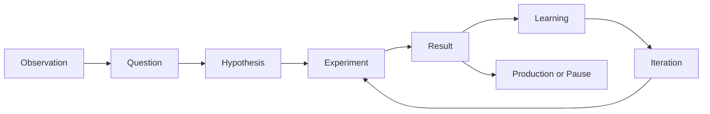

# ADR-001: Project Curiosity Is an Engineering Notebook

| Field             | Value                                                                   |
| ----------------- | ----------------------------------------------------------------------- |
| **Document ID**   | ADR-001                                                                 |
| **Title**         | Project Curiosity Is an Engineering Notebook                            |
| **Status**        | Accepted                                                                |
| **Version**       | 1.0                                                                     |
| **Date**          | 2026-08-03                                                              |
| **Owner**         | Alex Griffiths                                                          |
| **Decision Type** | Product, content and experience architecture                            |
| **Applies To**    | Website, documentation, content model, design system and implementation |

## 1. Decision Summary

Project Curiosity will be designed and built as an **engineering notebook**, not as a conventional software-developer portfolio, personal marketing site, blog or public GitHub index.

The public site will present a curated collection of questions, experiments, prototypes, systems and lessons. Its primary purpose is to make Alex's engineering behaviour visible: how he notices problems, frames questions, learns unfamiliar technologies, forms hypotheses, builds proofs of concept, evaluates trade-offs, changes direction and turns promising ideas into useful software.

The organising unit is therefore not the technology, job title or finished product. It is the **question and the engineering journey that followed**.

Most experiment stories should begin from a form of:

> **I wondered if...**

This is not a decorative slogan. It is the core information architecture and editorial model for the site.

---

## 2. Context

Traditional developer portfolios tend to follow a familiar structure:

1. name and role;
2. short biography;
3. list of skills;
4. grid of projects;
5. technology badges;
6. contact form.

That format is easy to recognise and quick to build, but it is poorly suited to the purpose of Project Curiosity.

Alex has more than twenty-five years of experience across technical support, systems engineering, application development, architecture, engineering leadership, cloud platforms, developer tooling, product discovery and applied AI. A conventional project grid would flatten that history into screenshots and technology labels. It would show that things were built, but not why they were built or how the engineering decisions were made.

The strongest recurring pattern in Alex's work is not allegiance to a framework or a particular role. It is a behaviour:

- he notices friction, gaps and opportunities;
- he investigates without waiting to be assigned a ticket;
- he learns whatever technology the problem requires;
- he creates prototypes and technical spikes to test ideas;
- he builds tools and reusable foundations that make other engineers more effective;
- he is comfortable working across product, frontend, backend, infrastructure, data and AI;
- he often identifies risks or opportunities before the organisation has formally recognised them.

The website must communicate that pattern clearly and credibly.

This matters particularly for senior product-engineering, Staff and Principal-level roles. At that level, hiring decisions are rarely based only on whether a candidate has used a named framework. Reviewers are trying to understand judgement, autonomy, technical range, product sense, communication and the ability to create leverage.

A static portfolio cannot prove all of those qualities, but a well-constructed engineering notebook can provide strong evidence.

---

## 3. Problem Statement

The project needs to solve five related problems.

### 3.1 A CV compresses behaviour into claims

A CV must be concise. It can say that Alex is curious, autonomous and able to learn quickly, but it cannot fully show the chain from observation through experimentation to production.

Without supporting evidence, statements such as "I learn quickly" or "I solve ambiguous problems" risk sounding generic.

### 3.2 Source code alone lacks context

A GitHub repository can show implementation, but it rarely explains:

- what prompted the work;
- who experienced the problem;
- what alternatives were considered;
- what assumptions proved wrong;
- what was deliberately left out;
- how the design evolved;
- whether the work created value.

Private repositories add another limitation: they cannot be browsed freely by recruiters or interviewers.

### 3.3 Finished products hide the useful mess

The polished end state is often the least revealing part of an engineering story. The interesting evidence sits in the uncertainty before it:

- the first hypothesis;
- the failed prototype;
- the architecture that was abandoned;
- the shortcut that became a problem;
- the unexpected discovery;
- the decision not to continue.

A conventional portfolio rewards visual polish and hides this process. Project Curiosity should do the opposite.

### 3.4 The projects appear unrelated without a coherent frame

DeliveryIQ, Chronos, Token Burn, SafeNet and Morris span engineering delivery, temporal knowledge graphs, games, alternative network architecture, symbolic AI, physics and agentic systems.

Presented as a list, they could look random. Presented as questions explored by the same engineer, they form a coherent body of work.

### 3.5 The site itself must demonstrate judgement

A technically elaborate but unreliable portfolio would undermine the intended message. The experience should be distinctive without becoming difficult to navigate, slow, fragile or self-indulgent.

The site must show that Alex can distinguish useful engineering from clever engineering theatre.

---

## 4. Decision Drivers

The following drivers shape this decision, in priority order.

### 4.1 Reveal how Alex thinks

The site must expose reasoning, not merely output.

### 4.2 Support credible evidence

Claims in the CV should be reinforced through concrete stories, diagrams, decisions, demos and selected code evidence.

### 4.3 Make complex projects understandable

A technically sophisticated reader should find depth, while a hiring manager should still be able to understand the problem and outcome quickly.

### 4.4 Reward honesty

The format must make room for failures, uncertainty, incomplete work and low-confidence ideas without presenting them as weaknesses.

### 4.5 Remain maintainable

Adding or updating an experiment must be a content-authoring task, not a redesign exercise.

### 4.6 Avoid portfolio clichés

The site should not resemble a generic developer template, an AI SaaS landing page or a corporate brochure.

### 4.7 Work without gimmicks

The core experience must remain coherent, fast and usable without WebGL, heavy motion or experimental navigation.

---

## 5. Goals

Project Curiosity will:

1. present selected engineering work as structured experiment stories;
2. begin with the question or observation that triggered each project;
3. explain the user, business or intellectual problem behind the work;
4. document hypotheses, prototypes, architecture, trade-offs, failures and learning;
5. connect apparently different projects through the common theme of curiosity;
6. demonstrate the ability to learn unfamiliar technologies in context;
7. show evidence of product thinking as well as technical skill;
8. provide enough depth to support senior engineering interviews;
9. offer controlled access to private source repositories or guided walkthroughs where appropriate;
10. remain readable, accessible and useful on ordinary devices and connections.

---

## 6. Non-Goals

Project Curiosity is not intended to be:

- a complete archive of every repository Alex has created;
- a chronological copy of the CV;
- a comprehensive tutorial site;
- a technology-badge collection;
- a personal brand campaign built around inflated claims;
- a daily or weekly blogging commitment;
- a public mirror of private source code;
- an interactive art piece whose navigation must be learned;
- proof that every experiment became commercially successful;
- an attempt to make unfinished research appear production-ready.

The site may contain technically impressive interactions, but spectacle is never the primary objective.

---

## 7. The Engineering Notebook Model

An engineering notebook records the movement from uncertainty toward understanding.

That model gives each experiment a consistent narrative shape:

Not every experiment follows the sequence neatly. Some begin with a customer request, some with technical frustration, and some with a speculative question. The structure is a guide, not a fictional scientific method imposed after the event.

The notebook model requires the content to preserve uncertainty where it genuinely existed. Authors must not rewrite the journey to make every decision look inevitable.

### 7.1 Core story elements

Each substantial experiment should answer:

1. **What made me stop and think?**
2. **What problem or possibility did I see?**
3. **Why was it worth exploring?**
4. **What did I initially believe might work?**
5. **How did I test that belief?**
6. **What did I build?**
7. **What was technically difficult or interesting?**
8. **What failed, surprised me or changed my mind?**
9. **What did I learn?**
10. **What happened next?**

### 7.2 Experiment states

Experiments are not forced into a binary finished/unfinished status. The content model should support states such as:

- **Exploring** — the question is active and the approach remains uncertain;
- **Prototype** — a working proof exists, but it is not production-ready;
- **Growing** — the system is being actively extended;
- **Shipped** — the work is in real use;
- **Paused** — useful learning exists, but active work has stopped;
- **Dormant** — retained for future investigation;
- **Abandoned** — deliberately stopped after the hypothesis failed or priorities changed;
- **Escaped containment** — an optional, sparingly used humorous state reserved for Morris-related incidents.

The state must be honest and must not imply maturity that the project has not earned.

### 7.3 Confidence and evidence

Where useful, an experiment may show a confidence or maturity assessment. This must be explained rather than reduced to a decorative score.

Evidence may include:

- architecture diagrams;
- screenshots;
- short demonstrations;
- extracts from design notes;
- selected source excerpts;
- benchmarks;
- test results;
- decision records;
- before-and-after comparisons;
- links to public repositories;
- an invitation to request private repository access or a guided walkthrough.

Evidence should support the story. It should not become a dump of artefacts.

---

## 8. Content Architecture Consequences

Because the site is an engineering notebook, its information architecture will use the following language and hierarchy.

### 8.1 Primary public concepts

| Conventional label | Project Curiosity label        |
| ------------------ | ------------------------------ |
| Projects           | Experiments                    |
| Blog               | Research Notes or Observations |
| About              | How I Ended Up Here            |
| Last updated       | Last investigated              |
| Status             | Current state                  |
| Portfolio          | Engineering notebook           |

These terms should be used when they improve the experience, not as forced novelty. Clear language wins when a playful label would confuse navigation.

### 8.2 Project discovery begins with questions

The homepage should encourage visitors to browse questions rather than technologies.

Examples:

- **What would engineering delivery look like if AI was designed into the workflow from the beginning?**
- **What if history could be explored as a connected temporal system rather than isolated articles?**
- **Can symbolic reasoning and generative models become more capable together?**
- **What might the web look like if its protocols and data-rights model were redesigned today?**
- **Can a deliberately simple rogue-like game become unreasonably difficult to put down?**

The project name remains important, but the question provides the reason to care.

### 8.3 Technology is supporting metadata

Technology should appear where it explains an engineering decision or helps a technical reader orient themselves.

It should not dominate page titles, card layouts or narratives.

The content should answer:

> Why was Rust appropriate here?

rather than merely displaying:

> Rust

### 8.4 Notes are connected to experiments

Research notes should be linkable to the experiments that produced them. The site should gradually form a small knowledge graph of questions, concepts, technologies, observations and decisions.

This relationship model is a future capability, but the initial content schema must not prevent it.

---

## 9. Experience and Visual Consequences

The engineering-notebook decision implies an editorial and research-oriented experience.

The intended feeling is somewhere between:

- a well-organised field notebook;
- an engineering lab journal;
- an annotated technical paper;
- a museum archive of ongoing experiments;
- a thoughtful workshop.

The site should feel personal and slightly unconventional without becoming chaotic.

### 9.1 Required experience characteristics

The interface should be:

- readable before it is decorative;
- calm rather than loud;
- tactile without pretending to be physical paper;
- technically precise without feeling corporate;
- playful in details rather than in basic navigation;
- rich in diagrams and annotations;
- comfortable with whitespace;
- usable with motion disabled;
- fully navigable without WebGL or advanced browser features.

### 9.2 Explicit visual anti-patterns

The following patterns are inconsistent with this ADR unless a later accepted ADR provides a strong reason:

- neon-on-black cyberpunk styling;
- corporate blue SaaS presentation;
- glassmorphism;
- animated particle backgrounds;
- skill bars and percentage rings;
- typing-effect hero text;
- 3D navigation that replaces normal document structure;
- smooth-scroll hijacking;
- large blocks of technology logos;
- stock illustrations of developers;
- decorative motion that competes with reading;
- generic claims such as "innovative", "cutting edge" or "world class".

Three.js and other experimental technologies are not banned. They must be used only where they explain a project or create genuine value, and the content must remain available without them.

---

## 10. Voice and Editorial Consequences

The notebook voice should sound like Alex explaining an interesting problem to another engineer.

It should be:

- curious;
- direct;
- technically literate;
- honest about uncertainty;
- willing to admit failure;
- confident without marketing theatre;
- occasionally dry or mischievous;
- understandable without stripping away meaningful technical detail.

### 10.1 Preferred forms

Use language such as:

- "I wondered if..."
- "The part that bothered me was..."
- "My first assumption was..."
- "The prototype showed..."
- "This failed because..."
- "I changed direction when..."
- "The interesting constraint was..."
- "I would approach this differently now..."

### 10.2 Avoided forms

Avoid language such as:

- "revolutionary";
- "ground-breaking";
- "best in class";
- "game-changing";
- "leveraging cutting-edge technology";
- "passionate thought leader";
- claims that a prototype solved a problem it only explored.

The site must earn its claims through evidence.

---

## 11. Initial Experiment Set

The first public release is expected to centre on five experiments.

### 11.1 DeliveryIQ

**Question:** What would engineering delivery look like if AI were designed into the workflow from the beginning rather than added to Jira or Azure DevOps afterwards?

The story should cover engineering friction, agent-based workflows, product and delivery intelligence, automation and the process of learning agent architecture through a real product problem.

### 11.2 Chronos

**Question:** What if history could be explored as a connected temporal knowledge graph rather than a collection of isolated articles and timelines?

The story should begin with Alex's wife's request for a more joined-up way to explore history and follow the evolution toward a temporal knowledge-graph platform and mobile application.

### 11.3 Token Burn

**Question:** Can a small set of mechanics produce a mobile rogue-like game that is simple, fair and extremely difficult to put down?

This experiment demonstrates range, playfulness, product iteration, balancing and the joy of building something because it is fun.

### 11.4 SafeNet

**Question:** What might a new web architecture look like if protocols, servers, identity and data rights were reconsidered from first principles?

The story should be explicit that success is uncertain. Its value lies in exploring Rust, alternative protocols, distributed trust and a radically different ownership model.

### 11.5 Morris

**Question:** Can symbolic AI, language models, diffusion models and agents combine into a system that can reason, adapt and create tools more effectively than any one technique alone?

The story should connect Morris to physics simulations and symbolic reasoning, describe its language and CLI, and document both progress and containment failures without pretending that AGI has been achieved.

---

## 12. Considered Alternatives

### 12.1 Conventional developer portfolio

**Description:** A polished homepage with biography, skills, project cards and contact details.

**Advantages:**

- familiar to visitors;
- quick to build;
- easy to scan;
- broadly compatible with templates.

**Rejected because:**

It would optimise for presentation rather than evidence. It would make Alex's most unusual strength — curiosity-led, autonomous problem solving — look like a list of technologies and screenshots.

### 12.2 Public GitHub profile as the portfolio

**Description:** Curate pinned repositories and direct reviewers to source code.

**Advantages:**

- minimal maintenance;
- code is visible directly;
- familiar to engineers.

**Rejected because:**

Many important repositories are private, source code lacks product context, and repository quality varies because experiments are working spaces rather than polished public packages.

GitHub remains evidence, but not the primary narrative surface.

### 12.3 Technical blog

**Description:** Publish a sequence of articles about projects and technologies.

**Advantages:**

- supports depth;
- search-engine friendly;
- familiar editorial model.

**Rejected because:**

A blog prioritises recency and publishing cadence. Project Curiosity needs durable, evolving experiment records that can be revised as the work changes. Research notes may exist, but they will support the notebook rather than define it.

### 12.4 Interactive 3D portfolio

**Description:** Use Three.js and a spatial or spiral navigation model to create a highly distinctive experience.

**Advantages:**

- memorable;
- technically demonstrative;
- visually impressive when working well.

**Rejected because:**

It creates unnecessary navigation risk, mobile and accessibility problems, performance costs and a high chance that the interface becomes more memorable than the projects. A restrained 3D or interactive visual may be used inside a relevant experiment page, but not as the primary site structure.

### 12.5 CV microsite

**Description:** Reproduce Alex's employment history and skills as an interactive résumé.

**Advantages:**

- direct support for job applications;
- simple content structure;
- easy for recruiters to scan.

**Rejected because:**

The CV already serves that purpose. The site must provide the evidence and personality that the CV cannot contain, rather than duplicating it.

---

## 13. Consequences

### 13.1 Positive consequences

- The site gains a coherent identity across very different projects.
- It supports deeper Staff and Principal-level interview conversations.
- It demonstrates product reasoning, not only implementation skill.
- Unfinished and failed work can be presented honestly and usefully.
- Private repositories can remain private while their engineering stories are still visible.
- The content can grow over time without requiring a complete redesign.
- The site's design and writing reinforce the same central narrative as the CV.

### 13.2 Negative consequences

- Producing strong project stories requires more effort than displaying repository cards.
- Alex must write candidly about decisions and failures, which may feel less comfortable than listing achievements.
- Content quality becomes a core product dependency.
- The site may be less instantly familiar to visitors expecting a standard portfolio.
- The engineering-notebook metaphor can become contrived if applied too aggressively.
- Maintaining evolving experiment pages requires editorial discipline.

### 13.3 Risks

#### Risk: over-engineering the documentation instead of shipping

The project could become an elaborate specification exercise with no public outcome.

**Mitigation:** define a deliberately small initial release and treat documentation as a means of reducing ambiguity, not a substitute for implementation.

#### Risk: novelty language harms usability

Renaming every conventional concept could make navigation confusing.

**Mitigation:** use clear labels in primary navigation and reserve distinctive language for supporting details where meaning remains obvious.

#### Risk: humour weakens credibility

Morris-related jokes and playful statuses could make serious technical work look frivolous.

**Mitigation:** use humour sparingly, after technical credibility has been established, and never as a substitute for explaining limitations.

#### Risk: the site becomes self-indulgent

Long-form project stories could focus on Alex's interests without helping the reader.

**Mitigation:** every page must provide a clear entry point, concise summary and skimmable structure before deeper technical material.

#### Risk: sensitive information is exposed

Project stories or private repository evidence may accidentally reveal employer, customer, security or intellectual-property details.

**Mitigation:** all public content must be reviewed for confidentiality, licensing, security and ownership before publication.

---

## 14. Implementation Constraints

This ADR does not select the final application framework, but it places constraints on implementation.

1. Experiment content must be separable from page components and capable of structured authoring.
2. The content model must support questions, states, dates, technologies, related notes, evidence and repository-access information.
3. Core content must be statically renderable and accessible without client-side JavaScript where practical.
4. Progressive enhancement must be preferred over interaction-dependent reading.
5. Design tokens and components must support a consistent editorial layout.
6. Diagrams should use accessible SVG, HTML or other durable formats rather than image-only text.
7. Performance budgets must prevent decorative features from degrading reading.
8. Reduced-motion preferences must be respected.
9. Private repository credentials, tokens and source contents must never be embedded in the public application.
10. The website must remain useful if all future AI features are disabled.

---

## 15. MVP Interpretation

The minimum viable engineering notebook is not the smallest possible website. It is the smallest release that proves the concept.

The first release should include:

- a homepage explaining the "Things I Wondered About" idea;
- an experiment index organised around questions;
- complete stories for at least three experiments;
- an "How I Ended Up Here" page;
- a concise current-obsessions section;
- a contact path;
- a clear mechanism for stating repository visibility and walkthrough availability;
- responsive, accessible editorial layouts;
- no dependency on Morris, RAG, repository indexing or interactive graphs.

DeliveryIQ, Chronos and Morris are the strongest candidates for the initial complete stories. SafeNet and Token Burn may launch with shorter entries and expand later.

---

## 16. Decision Tests

Future product, design and implementation decisions should be tested against the following questions.

1. Does this help a visitor understand how Alex thinks?
2. Does it clarify the question, decision or lesson?
3. Is the technology serving the story, or competing with it?
4. Would the experience still work on a modest phone and slow connection?
5. Does the content remain credible if the reader is a senior engineer?
6. Are uncertainty and limitations represented honestly?
7. Is the feature useful without explanation from Alex?
8. Is this the simplest reliable way to achieve the intended effect?
9. Would removing it make the story less understandable?
10. Are we building evidence, or merely decoration?

A decision that repeatedly fails these tests should not be implemented without a new ADR.

---

## 17. Acceptance Criteria

This ADR is successfully implemented when:

- [ ] the repository and public site describe Project Curiosity as an engineering notebook;
- [ ] the primary experiment model begins with a question or motivating observation;
- [ ] the homepage prioritises questions and stories over technology lists;
- [ ] experiment pages provide space for hypotheses, failures, decisions and learning;
- [ ] the initial content schema supports the experiment states defined here;
- [ ] technology appears as supporting evidence rather than the main organising principle;
- [ ] the visual design is editorial, restrained and readable;
- [ ] core navigation works without experimental interaction models;
- [ ] project content can be consumed without access to private repositories;
- [ ] public claims are supported by visible evidence or clearly identified as hypotheses;
- [ ] at least three launch experiments demonstrate the notebook model end to end;
- [ ] later implementation specifications explicitly reference ADR-001.

---

## 18. Review and Change Policy

This decision should be reviewed if any of the following becomes true:

- the site is repurposed primarily as a commercial product or consultancy site;
- user research shows that the notebook framing materially prevents relevant hiring audiences from understanding Alex's experience;
- content maintenance becomes impractical;
- the public audience changes substantially;
- the project evolves into a multi-author platform;
- the experiment model no longer represents the work being published.

Minor changes to language, section order or visual execution do not require a replacement ADR. Replacing the engineering-notebook model with a portfolio, blog, CV site or application-first experience does.

If this decision is superseded, the following documents and systems must be reviewed:

- root `README.md`;
- documentation index and product vision;
- design rules;
- writing rules;
- UX rules;
- experiment content schema;
- homepage specification;
- experiment-page specification;
- navigation labels;
- metadata and SEO descriptions;
- Cursor and coding-agent instructions.

---

## 19. Related Documents

The following documents should reference or extend this ADR when created:

- `docs/foundations/DESIGN-RULES.md`
- `docs/foundations/WRITING-RULES.md`
- `docs/foundations/UX-RULES.md`
- `docs/foundations/TECHNICAL-RULES.md`
- `docs/foundations/CURSOR-RULES.md`
- `docs/foundations/PROJECT-STRUCTURE.md`
- experiment content schema specification
- homepage product specification
- experiment-page product specification
- ADR covering structured content and MDX
- ADR covering progressive enhancement and motion

---

## 20. Final Rationale

Project Curiosity exists because a list of technologies cannot explain the most valuable part of Alex's engineering experience.

The recurring pattern is that he sees an interesting problem, asks a question, learns what is needed, builds something to test the idea and follows the evidence wherever it leads. Sometimes that produces a production platform. Sometimes it produces a useful tool. Sometimes it produces a game. Sometimes it produces a damaged laptop and a better understanding of what not to give Morris access to.

An engineering notebook is the format capable of holding all of those outcomes without flattening them into marketing claims.

The intended reader should leave with a clear impression:

> Alex is a curious, autonomous engineer who explores difficult questions, builds credible evidence and turns promising ideas into practical systems.

That is the decision this ADR protects.
